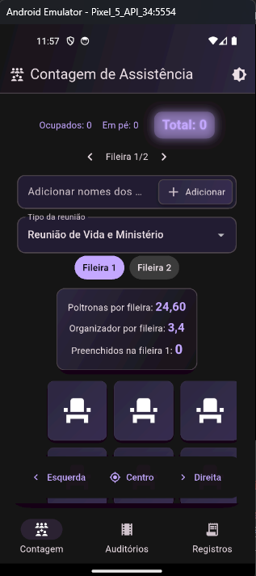
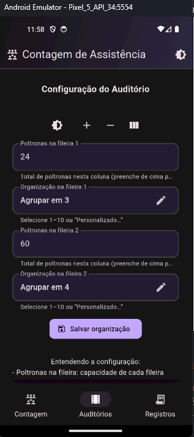
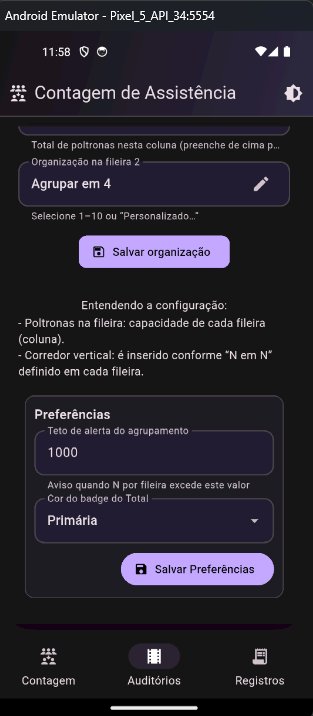
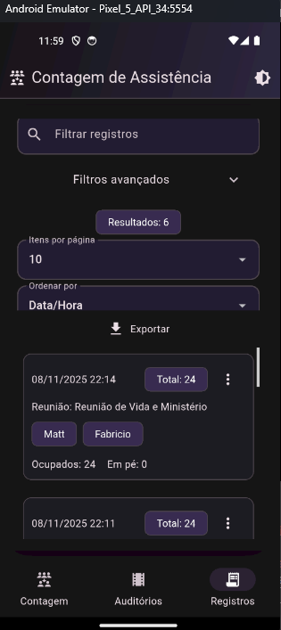
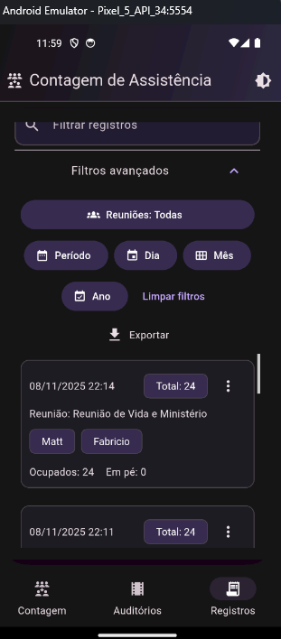
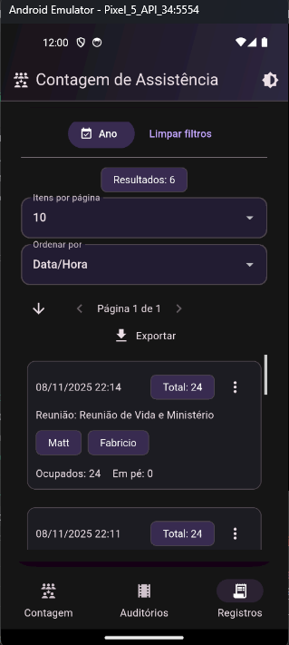
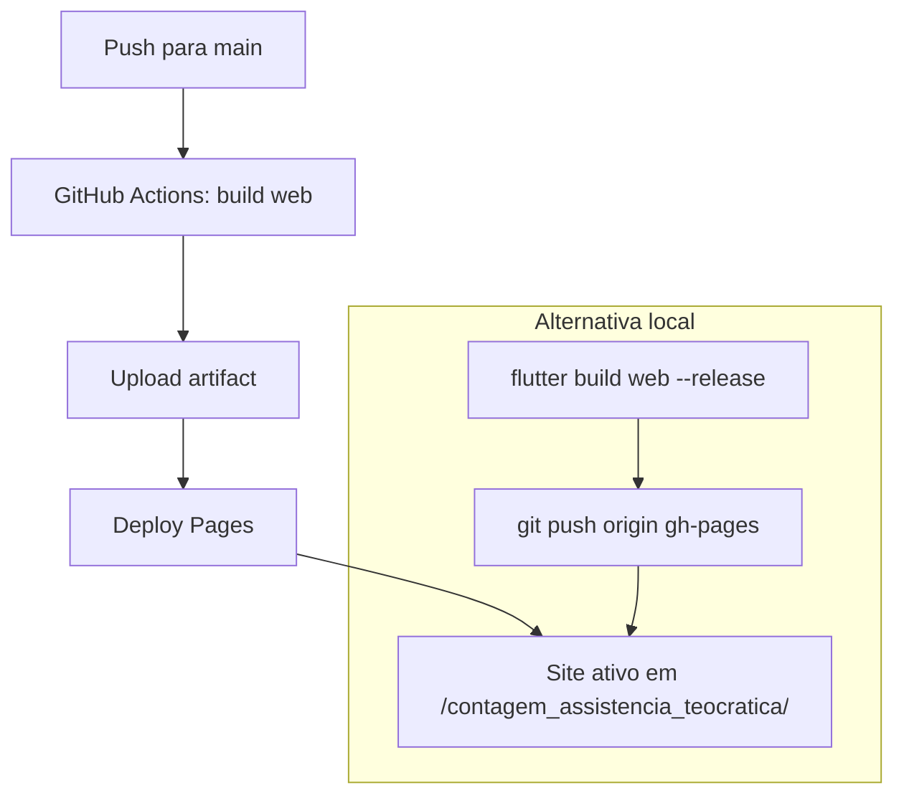

# Contagem de Assistência Teocrática

   

Aplicativo Flutter para registrar e consultar contagens de assistência de reuniões teocráticas, com exportação de dados e demonstração Web (GitHub Pages).

## Overview
- Stack principal: Flutter/Dart (mobile-first + build Web para demo)
- Deploy: GitHub Pages automatizado via GitHub Actions (base-href dinâmico)
- Foco: registro rápido de contagens e consulta/exportação de registros

## Demo Web
Teste diretamente no navegador:

- URL: https://reinaldobarreto.github.io/contagem_assistencia_teocratica/

[](https://reinaldobarreto.github.io/contagem_assistencia_teocratica/)

[](https://github.com/reinaldobarreto/contagem_assistencia_teocratica/actions/workflows/deploy.yml)

Se o repositório usar outro nome, ajuste o `--base-href` no workflow e atualize o link acima.

## Finalidade
- Registrar rapidamente ocupação e indicadores por reunião.
- Consultar registros com busca por texto, tipo de reunião, período e ordenação.
- Exportar dados filtrados em CSV ou imagem PNG da lista.

## Funcionalidades
- Cadastro e edição de registros de reuniões.
- Busca textual abrangente (inclui nomes de indicadores).
- Filtros de período e tipo de reunião.
- Ordenação por data/hora, tipo de reunião, indicadores e totais.
- Exportar CSV (filtrados) e Exportar PNG (filtrados).
- Persistência local com `SharedPreferences`.

## Telas
- Contagem: registrar ocupação, indicadores e notas.
- Registros: buscar/filtrar/ordenar e exportar os registros.

## Capturas de tela
Ordem: Contagem, Auditório, Registros. Cada imagem abaixo é real e segue os nomes padronizados.










Sugestão de nomes dos arquivos enviados:
- `docs/images/contagem.png` (primeira tela — Contagem)
- `docs/images/auditorio-config-1.png` (configuração do auditório — parte 1)
- `docs/images/auditorio-config-2.png` (configuração do auditório — parte 2)
- `docs/images/auditorio-preferencias.png` (preferências do auditório)
- `docs/images/registros-filtros-1.png` (tela Registros com filtros avançados — exemplo 1)
- `docs/images/registros-filtros-2.png` (tela Registros com filtros avançados — exemplo 2)
- `docs/images/registros-lista.png` (lista de registros com opção Exportar)

### Como adicionar rapidamente (screenshots)
1. Faça as capturas no dispositivo/emulador (PNG/JPG).
2. Salve os arquivos na pasta `docs/images/` com os nomes padronizados acima.
3. Faça commit e push para ver as imagens renderizadas no README.

Dica: você pode usar HTML no README para imagens lado a lado (como na galeria) e controlar a largura via atributo `width`.

Observação: as imagens aparecem diretamente no README do GitHub (independente do GitHub Pages). GitHub Pages afeta apenas a demo publicada.

### Galeria rápida
Visual do app em uma grade compacta para leitura rápida:

<p>
  
  
  
</p>
<p>
  
  
  
  
</p>

## Tecnologias e Ferramentas
- Stack principal: Flutter 3.x / Dart 3.x (mobile-first + build Web para demo)
- Plataformas: Android (API 26+) e Web (Chrome)
- Persistência: `SharedPreferences` (local, sem backend)
- Exportação: CSV e PNG (lista filtrada) integradas ao app
- Testes: `flutter test` para CSV, fluxo real de dados e widgets
- Deploy: GitHub Pages automatizado via GitHub Actions (`actions/deploy-pages@v4`)
- CI/CD: badge de status do workflow de deploy no README
- Ferramentas: VS Code, Android Studio, Git
- Análise estática: `analysis_options.yaml` com lints do Flutter/Dart
- Estrutura de assets: `docs/images` (screenshots do README) e `web/` (ícones/manifest)

### Ícones da stack
Ícones espelhados do fintrack360 (Simple Icons via shields.io):

<p>
  
  
  
  
  
  
  
  
</p>

## Pré‑requisitos
- Flutter SDK (canal estável): https://flutter.dev/docs/get-started/install
- Android SDK/Emulador ou dispositivo físico com depuração USB.

## Como clonar e importar (VS Code e Android Studio)
Requisitos:
- Flutter stable (3.x) e Dart SDK (incluso no Flutter)
- Git instalado
- VS Code com extensões: Flutter e Dart
- Android Studio com Android SDK e AVD (emulador) configurados
- Navegador Chrome (para executar em Web)

Verifique o ambiente:
```powershell
flutter doctor
```

Clonar o projeto:
```powershell
git clone https://github.com/reinaldobarreto/contagem_assistencia_teocratica.git
cd contagem_assistencia_teocratica
flutter pub get
```

Habilitar Web (uma vez):
```powershell
flutter config --enable-web
```

Importar e rodar no VS Code:
- Abra o projeto: `code .`
- Selecione o dispositivo: `Ctrl+Shift+P → Flutter: Select Device → Chrome (ou emulador Android)`
- Rode o app: `F5` ou `flutter run -d chrome`

Importar e rodar no Android Studio:
- File → Open... e selecione a pasta `contagem_assistencia_teocratica`
- Instale plugins Flutter e Dart se solicitado
- Aceite licenças do Android: `flutter doctor --android-licenses`
- Crie/abra um emulador: AVD Manager → crie um dispositivo (ex.: Pixel 5 API 34)
- Baixe dependências: `flutter pub get`
- Rode: selecione o emulador no topo e clique em Run

## Guia passo a passo (VS Code)
- Instale extensões: `Flutter` e `Dart`.
- Abra a pasta do projeto: `code .`.
- Baixe dependências: `flutter pub get`.
- Habilite Web (uma vez): `flutter config --enable-web`.
- Selecione o dispositivo: `Ctrl+Shift+P → Flutter: Select Device → Chrome` (ou um emulador Android).
- Execute:
  - Web: `F5` ou `flutter run -d chrome`.
  - Android: `flutter run` com um dispositivo/emulador selecionado.
- Hot reload: `r` no terminal do Flutter ou ícone de reload no VS Code.
- Hot restart: `R` no terminal do Flutter.

Para Android físico:
- Ative a Depuração USB no dispositivo.
- Conecte por cabo, aceite a impressão digital.
- Verifique se aparece em `flutter devices`.

Para Android emulador:
- Crie um AVD no Android Studio (AVD Manager, ex.: Pixel 5 API 34) e inicie.
- Selecione o emulador no VS Code e execute.

## Guia passo a passo (Android Studio)
- Abra: `File → Open...` e selecione a pasta do projeto.
- Instale plugins Flutter e Dart se solicitado.
- SDK Manager: instale Android SDK/Platform Tools (ex.: API 34).
- Aceite licenças: `flutter doctor --android-licenses`.
- AVD Manager: crie um emulador (ex.: Pixel 5 API 34) e inicie.
- Baixe dependências: `flutter pub get`.
- Execute: selecione o dispositivo/emulador no topo e clique em `Run`.

Dicas:
- Terminal integrado: `View → Tool Windows → Terminal` para rodar `flutter`.
- Se Gradle/SDK falhar: `flutter clean && flutter pub get`.
- Se o Android SDK não for encontrado: instale via Android Studio e rode `flutter doctor` novamente.

## Executar em desenvolvimento
```powershell
# Emulador Chrome (Web)
flutter run -d chrome

# Dispositivo Android conectado
flutter run -d <serial-do-dispositivo>
```

## Build de release (Android)
```powershell
flutter build apk --release
# APK gerado em build\app\outputs\flutter-apk\app-release.apk
```

## Execução rápida por linha de comando
- Web (Chrome): `flutter run -d chrome`
- Android (emulador/dispositivo): `flutter run`

## Instalação de APK em dispositivo (opcional)
```powershell
adb install -r build\app\outputs\flutter-apk\app-release.apk
```

## Exportações (na Tela Registros)
- Exportar CSV (filtrados): compartilha texto CSV.
- Exportar PNG (filtrados): compartilha imagem da lista filtrada.

## Publicação (GitHub Pages)
Este projeto inclui um workflow que compila e publica automaticamente em GitHub Pages.

Passos:
1. Faça push para `main` com o workflow presente.
2. No GitHub, vá em `Settings → Pages → Build and deployment → Source` e selecione `GitHub Actions`.
3. Acompanhe a execução em `Actions`: "Deploy Flutter Web to GitHub Pages".
4. Acesse: `https://<seu-usuario>.github.io/<nome-do-repo>/`.

Observações:
- O workflow define `--base-href` automaticamente para o nome do repositório.
- Use o badge de status para verificar o deploy.

### Fluxo de deploy (mini)
Você pode publicar de duas formas. O diagrama abaixo resume:



### Links úteis
- Repo: https://github.com/reinaldobarreto/contagem_assistencia_teocratica
- README: https://github.com/reinaldobarreto/contagem_assistencia_teocratica/blob/main/README.md
- Site (Pages): https://reinaldobarreto.github.io/contagem_assistencia_teocratica/
- Settings → Pages: https://github.com/reinaldobarreto/contagem_assistencia_teocratica/settings/pages
- Actions → Deploy: https://github.com/reinaldobarreto/contagem_assistencia_teocratica/actions/workflows/deploy.yml
- Branch de publicação: `gh-pages` (raiz)

## Desenvolvimento local (Web)
```powershell
flutter run -d chrome
```

## Estrutura do projeto
- `lib/main.dart`: código principal das telas e lógica.
- `test/`: testes de CSV e fluxo de registros.
- `docs/images/`: capturas para README.
- `.github/workflows/deploy.yml`: publicação automática no GitHub Pages.

## Testes
Execute os testes unitários/localizados:
```powershell
flutter test
```
Testes principais:
- `test/csv_test.dart`: valida geração de CSV.
- `test/records_flow_csv_real_data_test.dart`: fluxo real de dados.
- `test/widget_test.dart`: validações de widget.

## Problemas comuns
- Se Gradle/SDK falhar: `flutter clean && flutter pub get`
- Se não encontrar Android SDK: abra o Android Studio para instalar SDK/Platform Tools e execute `flutter doctor` novamente
- Se a URL do Pages retornar 404: aguarde 1–2 minutos após o deploy ou confirme se o workflow terminou com sucesso

## Troubleshooting (GitHub Pages)
- Caminho do site: `https://<usuario>.github.io/<repo>/`
- Se 404 ou assets quebrados, confirme o `--base-href` igual a `/<repo>/`.
- Verifique o workflow na aba Actions e logs de build/deploy.

## Como contribuir
- Abra issues com sugestões e bugs.
- Use commits descritivos (ver exemplos abaixo).

## Exemplos de commits (histórico sugerido)
1. `docs: adiciona README com visão geral e setup`
2. `ci: configura GitHub Pages para Flutter Web`
3. `docs: cria estrutura docs/images para screenshots`
4. `feat(records): remove filtro por indicadores; mantém busca por texto`
5. `ui(records): remove opções Salvar CSV/JPG do menu`
6. `docs: guia de exportação e uso da tela Registros`
7. `build(web): instruções de base-href para Pages`
8. `chore: ajustes finais de documentação`

## Licença
Projeto de uso pessoal/demonstração. (Adapte conforme necessidade.)

## Autor
Reinaldo Barreto — Flutter/Dart

## Instalação via APK (Documentos)
Para distribuição direta, você pode usar o APK já salvo em `Documentos`.

- Caminho: `C:\Users\reinaldo\Documents\ContagemAssistenciaTeocratica-app-release.apk`
- Ative "Permitir apps desconhecidos" no Android (Arquivos/Drive).
- Abra o APK e confirme a instalação.

## Links rápidos
- Demo Web (Pages): https://reinaldobarreto.github.io/contagem_assistencia_teocratica/
- APK local (Windows): `C:\Users\reinaldo\Documents\ContagemAssistenciaTeocratica-app-release.apk`
