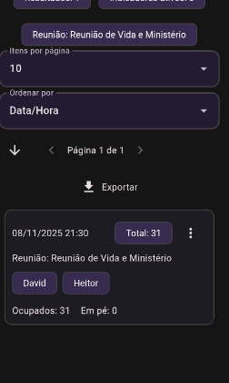

# Contagem de Assistência Teocrática

   

Aplicativo Flutter para registrar e consultar contagens de assistência de reuniões teocráticas, com exportação de dados e demonstração Web (GitHub Pages).

## Demo Web
Teste diretamente no navegador:

- URL: https://reinaldobarreto.github.io/contagem_assistencia_teocratica/

Se o repositório usar outro nome, ajuste o `--base-href` no workflow e atualize o link acima.

## Finalidade
- Registrar rapidamente ocupação e indicadores por reunião.
- Consultar registros com busca por texto, tipo de reunião, período e ordenação.
- Exportar dados filtrados em CSV ou imagem PNG da lista.

## Funcionalidades
- Cadastro e edição de registros de reuniões.
- Busca textual abrangente (inclui nomes de indicadores).
- Filtros de período e tipo de reunião.
- Ordenação por data/hora, tipo de reunião, indicadores e totais.
- Exportar CSV (filtrados) e Exportar PNG (filtrados).
- Persistência local com `SharedPreferences`.

## Telas
- Contagem: registrar ocupação, indicadores e notas.
- Registros: buscar/filtrar/ordenar e exportar os registros.

## Capturas de tela
As imagens devem ser colocadas em `docs/images/` e referenciadas abaixo. Personalize com capturas reais do app.

Exemplos sugeridos:
- `docs/images/contagem.png`
- `docs/images/registros.png`

```markdown


```

## Tecnologias
- Flutter 3.x (`mobile-first` e build Web)
- Dart 3.x
- Android (APK release)
- GitHub Pages (deploy Web automático)

## Pré‑requisitos
- Flutter SDK (canal estável): https://flutter.dev/docs/get-started/install
- Android SDK/Emulador ou dispositivo físico com depuração USB.

## Como clonar e configurar
```powershell
git clone <URL-do-repo>
cd contagem_assistencia_teocratica
flutter pub get
```

## Executar em desenvolvimento
```powershell
# Emulador Chrome (Web)
flutter run -d chrome

# Dispositivo Android conectado
flutter run -d <serial-do-dispositivo>
```

## Build de release (Android)
```powershell
flutter build apk --release
# APK gerado em build\app\outputs\flutter-apk\app-release.apk
```

## Instalação de APK em dispositivo (opcional)
```powershell
adb install -r build\app\outputs\flutter-apk\app-release.apk
```

## Exportações (na Tela Registros)
- Exportar CSV (filtrados): compartilha texto CSV.
- Exportar PNG (filtrados): compartilha imagem da lista filtrada.

## Demonstração Web (GitHub Pages)
Este projeto inclui um workflow para publicar automaticamente o build Web.

### Passo a passo
1. Crie o repositório no GitHub e empurre o código.
2. A primeira execução do workflow criará/atualizará o GitHub Pages.
3. Acesse: `https://<seu-usuario>.github.io/<nome-do-repo>/`

Observação: o workflow define `--base-href` automaticamente para o nome do repositório.

## Desenvolvimento local (Web)
```powershell
flutter run -d chrome
```

## Estrutura do projeto
- `lib/main.dart`: código principal das telas e lógica.
- `test/`: testes de CSV e fluxo de registros.
- `docs/images/`: capturas para README.
- `.github/workflows/deploy.yml`: publicação automática no GitHub Pages.

## Testes
Execute os testes unitários/localizados:
```powershell
flutter test
```
Testes principais:
- `test/csv_test.dart`: valida geração de CSV.
- `test/records_flow_csv_real_data_test.dart`: fluxo real de dados.
- `test/widget_test.dart`: validações de widget.

## Troubleshooting (GitHub Pages)
- Caminho do site: `https://<usuario>.github.io/<repo>/`
- Se 404 ou assets quebrados, confirme o `--base-href` igual a `/<repo>/`.
- Verifique o workflow na aba Actions e logs de build/deploy.

## Como contribuir
- Abra issues com sugestões e bugs.
- Use commits descritivos (ver exemplos abaixo).

## Exemplos de commits (histórico sugerido)
1. `docs: adiciona README com visão geral e setup`
2. `ci: configura GitHub Pages para Flutter Web`
3. `docs: cria estrutura docs/images para screenshots`
4. `feat(records): remove filtro por indicadores; mantém busca por texto`
5. `ui(records): remove opções Salvar CSV/JPG do menu`
6. `docs: guia de exportação e uso da tela Registros`
7. `build(web): instruções de base-href para Pages`
8. `chore: ajustes finais de documentação`

## Licença
Projeto de uso pessoal/demonstração. (Adapte conforme necessidade.)

## Instalação via APK (Documentos)
Para distribuição direta, você pode usar o APK já salvo em `Documentos`.

- Caminho: `C:\Users\reinaldo\Documents\ContagemAssistenciaTeocratica-app-release.apk`
- Ative "Permitir apps desconhecidos" no Android (Arquivos/Drive).
- Abra o APK e confirme a instalação.

## Links rápidos
- Demo Web (Pages): https://reinaldobarreto.github.io/contagem_assistencia_teocratica/
- APK local (Windows): `C:\Users\reinaldo\Documents\ContagemAssistenciaTeocratica-app-release.apk`
